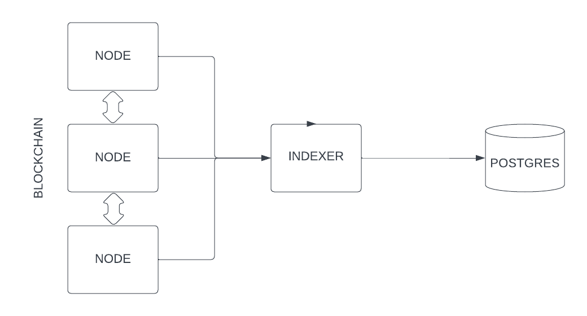

# Indexer

## Instruction

To start the service, you can run:

### `docker-compose up `

## Architecture
A simple architecture for this will be look like:

## Available Tools in Industry

### ETHEREUM ETL [LINK](https://github.com/blockchain-etl/ethereum-etl).
### THE GRAPH [LINK](https://thegraph.com/).
### DUNE ANALYTICS [LINK](https://dune.com).
### FOOTPRINT ANALYTICS [LINK](https://footprint.network/).

## Current Service is build using 
### 1. GO
### 2. Postgres
### 3. GO-Ethereum